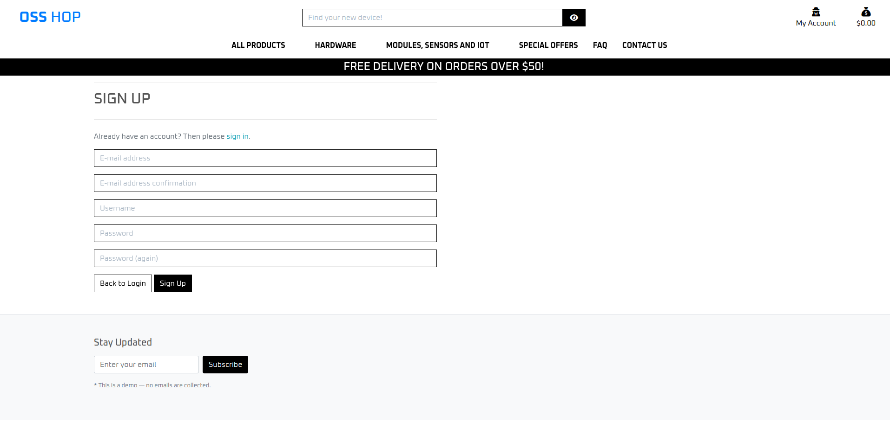

# OSShop


OSShop is a fully functional e-commerce web application that allows users to browse and purchase products online. It includes a responsive user interface, robust product management features for administrators, and a straightforward checkout process. Users can register accounts, leave reviews, and manage their order history. Admin users can manage inventory and customer communications via the admin dashboard. The live site can be found [here](https://osshop-c17df3faecbf.herokuapp.com/).

## Table of Contents
<details>
<summary>Click to expand</summary>

- [The OSShop](#salontalks)
- [UX](#ux)
- [Typography](#typography)
- [Color Palette](#color-palette)
- [User Stories](#user-stories)
- [Wireframes](#wireframes)
- [Features](#features)
  - [Existing Features](#existing-features)
  - [Site Pages](#site-pages)
  - [User Features](#user-features)
  - [Admin Features](#admin-features)
- [Future Features](#future-features)
- [Tools & Technologies Used](#tools--technologies-used)
- [Database Design](#database-design)
- [Agile Development Process](#agile-development-process)
  - [GitHub Projects](#github-projects)
  - [GitHub Issues](#github-issues)
  - [MoSCoW Prioritization](#moscow-prioritization)
- [Ecommerce Business Model](#ecommerce-business-model)
- [Search Engine Optimization (SEO) & Social Media Marketing](#search-engine-optimization-seo--social-media-marketing)
  - [Keywords](#keywords)
  - [Sitemap](#sitemap)
  - [Robots](#robots)
- [Testing & Validation](#testing--validation)
- [Deployment](#deployment)
  - [Postgres SQL Database](#postgres-sql-database)
  - [Cloudinary](#cloudinary)
    - [Setup](#setup)
  - [Stripe API](#stripe-api)
  - [Heroku Deployment](#heroku-deployment)
  - [Local Deployment](#local-deployment)
    - [Cloning](#cloning)
    - [Forking](#forking)
- [Credits](#credits)
- [Content](#content)
- [Media](#media)
- [Acknowledgements](#acknowledgements)

</details>

## UX
The design philosophy focuses on creating a clear and engaging experience for the target customers. Products is presented in a comfortable and clean manner, allowing users to navigate easily through the site to browse and make purchases.

## Typography
For a website targeting tech based audience a readable buy stylized font is used. Used on all parts of the site, allowing a pleasant consistent experience.

- **Headings:** Lekton
- **Body Text:** Lekton
- **Button Text/CTA:** lekton

All fonts are available for free on [Google Fonts](https://fonts.google.com/selection?query=open+sa).

## Color Palette
The color palette was created using [Coolors](https://coolors.co/)


### Readability & Accessibility
The palette keeps things simple and uses common black and white with a complimenting blue tone, ensuring good contrast for readability. Here are the key colors used:

- **Rick black (#081728):** A black but not black to be mellow on the eyes but still give the needed contrast.
- **seasalt (#F6F6F6):** a white that is again not fully white, softening the normally harsh black and white contrast.
- **Crayola blue (#3772FF):** A popping accent color for logos and other highlights.

## User Stories
All user stories can be found in the linked GitHub project [here](https://github.com/users/TheBlep/projects/4).


## Wireframes
<details>
<summary>Click to expand</summary>

### Homepage

- **Header:** Logo, Navigation (Home, Products, About, Contact), Search
- **Main:** Cover image with call to action and product purchase button
- **Footer:** newsletter sign up

### Product List View

- **Header:** Same as homepage
- **Main:** Sort options, Grid of products
- **Footer:** Newsletter Signup

### Product Detail Page

- **Header:** Same as homepage
- **Main:** Product details with images, description, and purchase options
- **Footer:** Newsletter Signup

### Shopping Bag

- **Header:** Same as homepage
- **Main:** List of cart items with total cost and checkout options
- **Footer:** Newsletter Signup

### Checkout

- **Header:** Same as homepage
- **Main:** Shipping and payment information
- **Footer:** Newsletter Signup

### My Account

- **Header:** Same as homepage
- **Sections:** Profile, Order History, Payment Methods
- **Footer:** Newsletter Signup

</details>

## Features
<details>
<summary>Click to expand</summary>

### Site Pages

| Home Page | Mobile View |
|-----------|-------------|
|  |  |

<div style="width: 100%; max-width: 600px; margin: 0 auto;">
    The main homepage for the site. The hero image is large and striking. A large heading tells users they are in the right place, and a call to action button invites users to enter and explore the site products. 
	<br><br>
	A border with a discount offer is placed under the menu to engage the user to make a good deal.
	<br><br>
	All pages have the same navbar at the top of the page to easily reach any view no matter where you are on the site. The navbar also contains a search field to quickly search for any content on the site.

</div>

---

#### Footer


The footer is shown on all pages except the home page. It contains a newsletter signup and submission button.
KNOWN BUG (Due to time constraints, the submission confirmation has not been finished. See known bugs below for solution) 

At the end there is a scroll-to-the-top arrow for quick navigation back to menu

---

### Product List View


<div style="width: 100%; max-width: 600px; margin: 0 auto;">
    The Product List View displays the products available for the user to purchase. It displays images of products and their essential information including title, description, price and category. Products are displayed in a pleasing responsive grid layout, making it easy for a user to browse them. Products can also be filtered and sorted by name, price and category.
	<br><br>
	Administrators viewing this page can see links under each Salon to edit or delete the product.
	<br>
</div>

---

### Product Detailed View
| Product Detailed View | Success Bag Toast |
|---------------------|-------------------|
|  |  |

<div style="width: 100%; max-width: 600px; margin: 0 auto;">
    Displays detailed information about the selected product, including images, descriptions, and purchase options.
</div>

---

### Checkout Page


Displays all items currently in the user's shopping basket. Users get a message if their basket is empty, otherwise they will see a list of products that they have selected with a button to navigate to the products page, and another to navigate to the checkout page.


A toast message is shown when item is removed from bag to give direct feedback.

---

### Checkout Page


Checkout Page displays an order summary of the items that are being prepared for purchase with accompanying item details. Displays a total cost of the order to the user. The user also sees a form to fill in their personal details. For logged in users, these details will be pre-filled if the user has provided that information in the past. A checkbox allows users to save entered information to their profile. A payment input form exists at the bottom of the page for a user to enter their payment card information. A message below this warns the user that advancing will complete the purchase and incur a charge to their card.

---

### Checkout Success Page


Displays a thank you message to the user. An order summary with all the relevant information, including a unique order number and the purchased product link is displayed.

---

### FAQ


FAQ Page. Displays the most frequently asked questions about the site. Lets users know essential information and quells worries that they may have about the site and its products. 

---

### Contact


 Users can contact the site owner using the contact form. A success toast is triggered when a message is sent.

---

### Contact Success


Users see this page after sending a contact message via the contact page. This page serves to confirm to the user that their message has been sent successfully. A short message on the contact form as well as on the navbar informs the user that their contact message has been received, and that one of the team will respond as soon as possible.

---

### Newsletter Subscription


Users can signup for Newsletter subscription. The subscription form can be found in the navbar on all pages. 


### Custom Error Pages


These provide a more user-friendly error page than the user would see otherwise and includes an informative message and button to return to the home of the site.

---

### User Features
---

### User Registration


Users can register for an account using a front-end form. This creates a user object in the database and automatically secures the user's sensitive information.

---

### User Login


Users who have made an account can quickly and easily log in to their account in order to access the login-required functionality of the site.

---

### Login Dependent Navbar Links


When users are logged in, 'Register' and 'Login' links are replaced with 'My Account' links. This provides the user with visual feedback upon logging in, as well as removing links that they will not need.

---

### User Logout


Users who are logged in can easily log out in order to stop access to their account-based information and functionality.

---

### User Password Recovery


Users who have forgotten their password can recover their password via the forgot password link on the login page. Users will enter their email and 'would' get a password reset link sent to their account email which they can use to set a new password. (emails are not actively sent at this time.)

---

### User Profile


User profiles are automatically created upon user registration. Displays a user's profile information. Lets a user see their relevant profile information in a clean and simple way, and contains an update form that users can use to update their profile information. Users can also see their order history, with full details of their order as well as links to see past order confirmations.

---

### Admin Features
---

### Add and Edit Product Page


If you are logged in as an administrator you will see links under each product to edit (blue link) or delete (red link) the product.


**Add Product:** Administrators can use a front-end form to create new site products. The form is simple and clean and automatically formats and displays the created product in the same manner as existing products. The form is found under My Account/Product management.

**Edit Product:** Administrators can use a front-end form to update existing products. If the current logged-in user has admin (superuser) privileges, an edit button will appear under products which allows that user to edit the product's details.

---

### Webhooks


The site uses a secure and robust webhook system to ensure that the payment process is not interrupted and corrupted, either through user error or malicious intent. Webhooks are incorporated via the Stripe payment system and are handled on the Stripe website, by way of the python code in checkout > webhook_handler.py and checkout > webhooks.py.

</details>

---

## Future Features
<details>
<summary>Click to expand</summary>

- **Fix remaining bugs** There are still a few bugs that need to be fixed including but not limited to: 
	- Adding the newsletter notifications
	- Adding email functionality
	- Remaking the image management to only use one image instead of one and one backup.

- **Subscription Model:** Implement a subscription payment option for a tech newsletter, utilizing Django groups and Stripe integration for backend management and webhook updates.
- **Newsletter Customization:** Develop a system for admins to customize and send newsletters, including a front-end form for text and images, integrated into newsletter views.
- **complete accessability** some portions of the website could better adhere to common accessability practices such as higher contrast and heading differences.
</details>


## Tools & Technologies Used
List of tools and technologies utilized in the project
<details>
<summary>Click to expand</summary>

- **HTML:** Main site content.
- **CSS:** Site design and layout.
- **JavaScript:** User interactions.
- **Python:** Back-end programming.
- **Git:** Version control (git add, commit, push).
- **GitHub:** Secure online code storage.
- **CODE - OSS:** Linux IDE for development.
- **Bootstrap:** Front-end CSS framework for responsiveness and components.
- **Django:** Python framework for the site.
- **PostgreSQL:** Relational database management.
- **CI Database:** PostgreSQL database service.
- **Psycopg2:** PostgreSQL database adapter.
- **Heroku:** Hosting for the back-end.
- **Stripe:** Secure online payments.
- **Cloudinary:** Image file storage.
- **Allauth:** User authentication system.
- **Pillow:** Image processing library.
- **Gunicorn:** WSGI server.
- **Crispy Forms:** Auto-formatting for front-end forms.
- **asgiref:** ASGI utilities for Django.
- **dj-database-url:** Database URL parsing for Django.
- **django-allauth**: User authentication system.
- **django-appconf**: Application configuration for Django.
- **django-countries**: Country field for Django forms.
- **django-crispy-forms**: Enhanced form handling in Django.
- **django-extensions**: Extensions for Django development.
- **django-storages**: Storage backends for Django.
- **django-tinymce**: WYSIWYG editor for Django.
- **jmespath**: JSON query language.
- **oauthlib**: OAuth library for Python.
- **PyJWT**: JSON Web Token implementation.
- **python3-openid**: OpenID support for Python.
- **pytz**: Time zone support for Python.
- **rcssmin**: CSS minification library.
- **requests-oauthlib**: OAuth for requests library.
- **rjsmin**: JavaScript minification library.
- **s3transfer**: S3 transfer manager for boto3.
- **sqlparse**: SQL parsing library.
- **stripe**: Stripe API for payments.
- **django-csp**: Content Security Policy middleware for Django.
</details>

## Database design

<details><summary><strong>ERD</strong></summary>


</details>

Generated with 

## Agile Development Process

<details><summary><strong>GitHub Projects</strong></summary>
[GitHub Projects](https://github.com/users/TheBlep/projects/4/views/1) served as an Agile tool for this project. Through it, user stories, labels and epics tasks were planned, then tracked using the basic Kanban board.

Epics were decomposed into smaller User Stories and Tasks. 

#### Project overview


#### Detailed Userstory


### MoSCoW Prioritization
The MoSCoW method was used with accompanying custom Github project labels to help prioritise the important tasks for the available time.
- **Must Have:** Core functionalities for MVP.
- **Should Have:** Important features for future development.
- **Could Have:** Enhancements for user experience.
- **Will Not Have:** Features for future consideration.

</details>

## Ecommerce Business Model
OSShop operates on a Business-to-Customer (B2C) model, focusing on one-time transactions.


The newsletter subscription list enables the business to communicate regularly with users, providing updates on last-chance products, new offerings, host announcements, and more.

## Search Engine Optimization (SEO) & Social Media Marketing

<details><summary><strong>Mock facebook pages using the given template</strong></summary>


<details><summary><strong>Keywords</strong></summary>

## Keywords
This project aims to create a supportive online community where individuals can connect, share experiences, and engage in meaningful conversations to combat loneliness. I’ve identified several relevant keywords to enhance the site’s visibility in search engines. This includes a mix of short-tail and long-tail keywords.

### Short-Tail Keywords
- OSS
- OSH
- Hacking
- Tech
- 3D Printing
- Open Source

### Long-Tail Keywords
- Make Tech work for you
- Open Source software
- Open Source hardware
- Prusa 3D printer
- Open source devices
- Open source modules
- Open source development boards and modules

<details><summary><strong>Sitemap & Robots</strong></summary>

### Sitemap & Robots
To help search engines find and index the site more effectively I added a sitemap in the root directory as well as a robots.txt with default settings instructions for web crawlers.

I've used [XML-Sitemaps](https://www.xml-sitemaps.com) and the [deployed site URL:](https://osshop-c17df3faecbf.herokuapp.com) 
to generate the sitemap.xml file.

- [sitemap.xml](sitemap.xml)
- [robots.txt](robots.txt) `

Links for future implementation:
- [Google search console](https://search.google.com/search-console)
- [Creating and submitting a sitemap](https://developers.google.com/search/docs/advanced/sitemaps/build-sitemap)
- [Managing your sitemaps and using sitemaps reports](https://support.google.com/webmasters/answer/7451001)
- [Testing the robots.txt file](https://support.google.com/webmasters/answer/6062598)

</div>

### Newsletter Marketing

A sign-up form is available on the site to allow users to submit their
email address to subscribe to our newsletter.

The email address list can be accessed from django admin.

## Testing & Validation

### Known Bugs
Due to the amount of time had to finish the project there are a few:
	- The newsletter signup does not send confirmation of signup
		- can be fixed by creating a specific app for it and connecting it to the toasts
	- The tags used for the navigation menu were only seen last minute to be incompatible.
		- can be fixed with proper research into what tag may nest (button, li, lu and div tags)

### Manual Testing Protocol
<details>
<summary>Features and workflows were manually tested across different screen sizes and browsers:</summary>

#### 1. User Story: Navigate the Site
- **Test Case 1**: Verify all navigation links are functional.
- **Test Case 2**: Check for broken links in the navigation menu.

#### 2. Browse the List of Products
- **Test Case 1**: Verify the list displays all upcoming products.
- **Test Case 2**: Check for pagination or infinite scroll functionality.
- **Test Case 3**: Verify product details are accessible from the list.

#### 3. Search for a Product
- **Test Case 1**: Verify search functionality returns relevant results.
- **Test Case 2**: Check for no results found message when applicable.
- **Test Case 3**: Verify search filters work correctly.

#### 4. Filter by Category
- **Test Case 1**: Verify filtering by category displays correct products.

#### 5. View Product Details
- **Test Case 1**: Verify product details are displayed correctly.
- **Test Case 2**: Check for the presence of images and descriptions.

#### 6. Create an Account
- **Test Case 1**: Verify account creation with valid inputs.
- **Test Case 2**: Check for validation messages on invalid inputs.
- **Test Case 3**: Verify the user can log in after account creation.

#### 8. User Profile Management
- **Test Case 1**: Verify user can update profile information.
- **Test Case 2**: Verify profile changes are saved and reflected on the profile page.
- **Test Case 3**: Verify user can change their password by clicking forgot password on the login page.

#### 9. Select Quantity
- **Test Case 1**: Verify quantity selection updates the shopping bag total.
- **Test Case 2**: Verify quantity selection reflects correctly in the shopping bag "preview".
- **Test Case 3**: Verify that you can keep shopping.

#### 10. View Products in Shopping Bag
- **Test Case 1**: Verify products are correctly added and displayed in the shopping bag.
- **Test Case 2**: Check for the correct total price in the shopping bag.
- **Test Case 3**: Verify the user can add and remove products from the shopping bag.
- **Test Case 4**: Verify the shopping bag persists after logging in/out.

#### 11. View the Total of Purchase
- **Test Case 1**: Verify total reflects all items in the shopping bag.
- **Test Case 2**: Check for correct application of discounts.
- **Test Case 3**: Verify total updates on quantity changes.

#### 12. Enter Payment Information
- **Test Case 1**: Verify payment form accepts valid inputs.
- **Test Case 2**: Check for validation on incorrect payment details.
- **Test Case 3**: Verify secure transmission of payment information.

#### 13. Purchase Ticket
- **Test Case 1**: Verify product purchase process completes successfully.
- **Test Case 2**: Check for appropriate error messages on failed purchases.

#### 14. View Order Confirmation
- **Test Case 1**: Verify order confirmation displays correct order details.
- **Test Case 2**: Verify order confirmation is sent via email.
- **Test Case 3**: Verify order is listed in My Account and that it can be clicked to come to the Product's order detail view.
- **Test Case 4**: Check for a unique order ID in the confirmation.

#### 15. Notifications
- **Test Case 1**: Verify toast messages appears on successful actions (e.g., product purchase).
- **Test Case 2**: Verify the content of the toast message is correct.
- **Test Case 3**: Verify notifications appear for relevant alerts (e.g., incorrect or missing input for required form fields).

#### 16. Manage Products
- **Test Case 1**: Verify that user, logged in as admin, can create a new product.
- **Test Case 2**: Verify that user, logged in as admin, have the ability to edit existing products.
- **Test Case 3**: Verify deletion of products works as intended.

#### 17. Logout
- **Test Case 1**: Verify that user can logout and login features are no longer accessed.
- **Test Case 2**: Check that user has to confirm the signout before signing out.

#### 20. FAQ
- **Test Case 1**: Verify the FAQ page is accessible.
- **Test Case 2**: Check for clarity and relevance of answers.
- **Test Case 3**: Verify the contact form and the subject option dropdown work correctly.

#### 21. Add an Product to the Store
- **Test Case 1**: Verify Administrator can successfully add an product.
- **Test Case 2**: Check for validation on required fields.
- **Test Case 3**: Verify added product appears in the store.

#### 22. Contact Form
- **Test Case 1**: Verify contact form is functional.
- **Test Case 2**: Check for confirmation message after submission.
- **Test Case 3**: Verify submission of invalid inputs returns errors.

</details>

### The code was validated with:
- **HTML**: Validated using the [W3C HTML Validator](https://validator.w3.org/)
- **CSS**: Validated using the [Jigsaw W3 Validator](https://jigsaw.w3.org/css-validator/)
- **JavaScript**: Validated using [JS Hint](https://jshint.com)
- **Python**: Validated using the [CI Python Linter](https://pep8ci.herokuapp.com/)
- **Performance**: Validated using [Pagespeed](https://pagespeed.web.dev/)

As can be seen there are some errors here that arose last minute due to tags. 
All other errors were fixed. Please see Known bugs above for further information.
The CSS is perfect and with some tweaking, the performance and Accessability are also quite high.


## Deployment
The live site is deployed on heroku and can be found here [deployed site](https://osshop-c17df3faecbf.herokuapp.com/) 

## Setup

<details>
<summary><strong>Postgres SQL Database</strong></summary>

The project utilizes 
[PostgreSQL from Code Institute](https://dbs.ci-dbs.net) 
(only available to current students of Code Institute)

Add your email to receive your database. To manage your databases, click on the management URL in the confirmation email. This URL is like a password and is unique to you. If you have forgotten or lost your management link, [click here](https://dbs.ci-dbs.net/manage/) to retrieve it.

</details>

<details>
<summary><strong>Cloudinary</strong></summary>

This project uses [Cloudinary](https://cloudinary.com/) to store media, due to the fact that Heroku doesn't persist this type of data.

Once you've created an Cloudinary account and logged-in, upload all media files in the static/images.
Make sure they re properly uploaded.

</details>

<details>
<summary><strong>Stripe API</strong></summary>

This project uses [Stripe](https://stripe.com) to handle the e-commerce payments.

Once you've created a Stripe account and logged-in, follow these series of steps to get your project connected.

- From your Stripe dashboard, click to expand the "Get your test API keys".
- You'll have two keys here:
	- `STRIPE_PUBLIC_KEY` = Publishable Key (starts with **pk**)
	- `STRIPE_SECRET_KEY` = Secret Key (starts with **sk**)

As a backup, in case users prematurely close the purchase-order page during payment, we can include Stripe Webhooks.

- From your Stripe dashboard, click **Developers**, and select **Webhooks**.
- From there, click **Add Endpoint**.
	- `https://osshop-c17df3faecbf.herokuapp.com/`
- Click **receive all products**.
- Click **Add Endpoint** to complete the process.
- You'll have a new key here:
	- `STRIPE_WH_SECRET` = Signing Secret (Wehbook) Key (starts with **wh**)

</details>

<details>
<summary><strong>Heroku Deployment</strong></summary>

This project uses [Heroku](https://www.heroku.com), a platform as a service (PaaS) that enables developers to build, run, and operate applications entirely in the cloud.

Deployment steps are as follows, after account setup:

- Select **New** in the top-right corner of your Heroku Dashboard, and select **Create new app** from the dropdown menu.
- Your app name must be unique, and then choose a region closest to you (EU or USA), and finally, select **Create App**.
- From the new app **Settings**, click **Reveal Config Vars**, and set your environment variables.

| Key | Value |
| --- | --- |
| `CLOUDINARY_CLOUD_NAME` | user's own value |
| `CLOUDINARY_API_SECRET` | user's own value |
| `CLOUDINARY_API_KEY` | user's own value |
| `DATABASE_URL` | user's own value |
| `DISABLE_COLLECTSTATIC` | 1 (*this is temporary, and can be removed for the final deployment*) |
| `SECRET_KEY` | user's own value |
| `STRIPE_PUBLIC_KEY` | user's own value |
| `STRIPE_SECRET_KEY` | user's own value |
| `STRIPE_WH_SECRET` | user's own value |

Heroku needs two additional files in order to deploy properly.

- requirements.txt
- Procfile

You can install this project's **requirements** (where applicable) using:

- `pip3 install -r requirements.txt`

If you have your own packages that have been installed, then the requirements file needs updated using:

- `pip3 freeze --local > requirements.txt`

The **Procfile** can be created with the following command:

- `echo web: gunicorn app_name.wsgi > Procfile`
- *replace **app_name** with the name of your primary Django app name; the folder where settings.py is located*

For Heroku deployment, follow these steps to connect your own GitHub repository to the newly created app:

Either:

- Select **Automatic Deployment** from the Heroku app.

Or:

- In the Terminal/CLI, connect to Heroku using this command: `heroku login -i`
- Set the remote for Heroku: `heroku git:remote -a app_name` (replace *app_name* with your app name)
- After performing the standard Git `add`, `commit`, and `push` to GitHub, you can now type:
	- `git push heroku main`

The project should now be connected and deployed to Heroku!

</details>

<details>
<summary><strong>Local Deployment</strong></summary>

This project can be cloned or forked in order to make a local copy on your own system.

For either method, you will need to install any applicable packages found within the *requirements.txt* file.

- `pip3 install -r requirements.txt`.

You will need to create a new file called `env.py` at the root-level,
and include the same environment variables listed above from the Heroku deployment steps.

Sample `env.py` file:

```python
import os

os.environ.setdefault("CLOUDINARY_CLOUD_NAME", "user's own value")
os.environ.setdefault("CLOUDINARY_API_SECRET", "user's own value")
os.environ.setdefault("CLOUDINARY_API_KEY", "user's own value")
os.environ.setdefault("DATABASE_URL", "user's own value")
os.environ.setdefault("SECRET_KEY", "user's own value")
os.environ.setdefault("STRIPE_PUBLIC_KEY", "user's own value")
os.environ.setdefault("STRIPE_SECRET_KEY", "user's own value")
os.environ.setdefault("STRIPE_WH_SECRET", "user's own value")

# local environment only (do not include these in production/deployment!)
os.environ.setdefault("DEBUG", "True")
```

Once the project is cloned or forked, in order to run it locally, you'll need to follow these steps:

- Start the Django app: `python3 manage.py runserver`
- Stop the app once it's loaded: `CTRL+C` or `⌘+C` (Mac)
- Make any necessary migrations: `python3 manage.py makemigrations`
- Migrate the data to the database: `python3 manage.py migrate`
- Create a superuser: `python3 manage.py createsuperuser`
- Load fixtures (if applicable): `python3 manage.py loaddata file-name.json` (repeat for each file)
- Everything should be ready now, so run the Django app again: `python3 manage.py runserver`

If you'd like to backup your database models, use the following command for each model you'd like to create a fixture for:

- `python3 manage.py dumpdata your-model > your-model.json`
- *repeat this action for each model you wish to backup*

#### Cloning

You can clone the repository by following these steps:

1. Go to the [GitHub repository](https://github.com/TheBlep/OSShop) 
2. Locate the Code button above the list of files and click it 
3. Select if you prefer to clone using HTTPS, SSH, or GitHub CLI and click the copy button to copy the URL to your clipboard
4. Open Git Bash or Terminal
5. Change the current working directory to the one where you want the cloned directory
6. In your IDE Terminal, type the following command to clone my repository:
	- `git clone https://github.com/TheBlep/OSShop.git`
7. Press Enter to create your local clone.

Alternatively, if using Gitpod, you can click below to create your own workspace using this repository.

[](https://gitpod.io/#https://github.com/TheBlep/OSShop)

Please note that in order to directly open the project in Gitpod, you need to have the browser extension installed.
A tutorial on how to do that can be found [here](https://www.gitpod.io/docs/configure/user-settings/browser-extension).

#### Forking

By forking the GitHub Repository, we make a copy of the original repository on our GitHub account to view and/or make changes without affecting the original owner's repository.
You can fork this repository by using the following steps:

1. Log in to GitHub and locate the [GitHub Repository](https://github.com/TheBlep/OSShop)
2. At the top of the Repository (not top of page) just above the "Settings" Button on the menu, locate the "Fork" Button.
3. Once clicked, you should now have a copy of the original repository in your own GitHub account!

</details>

---

## Credits

### Contributors

<details>
<summary><strong>Resources and Tutorials</strong></summary>

- **Django eCommerce Tutorial**: Comprehensive guide for building an eCommerce site using Django.
  - [GitHub Repository](https://github.com/imanaspaul/Django-eCommerce-tutorial-manascode/blob/master/ecommerce/ecommerce/settings.py)
  - [Part Two - Django Allauth](https://manascode.com/django-e-commerce-tutorial-part-two-django-allauth/)

- **Django Stripe Tutorial**: Guide for integrating Stripe payment processing.
  - [Learn Django](https://learndjango.com/tutorials/django-stripe-tutorial#configure-stripe)

- **Code Institute Course**: Resource for understanding Django fundamentals.
  - [Course Material](https://learn.codeinstitute.net/courses/course-v1:CodeInstitute+EA101+4/courseware/eb05f06e62c64ac89823cc956fcd8191/9c06563251a34ed19f5d4273ab4d55ab/?child=first)

- **FAQ Creation**: 
  - [Django Easy FAQ](https://pypi.org/project/django-easy-faq/)

- **Custom Error 404 Page**:
  - [YouTube Tutorial](https://www.youtube.com/watch?v=Tsmjxh4bj8k)

- **SEO Best Practices**:
  - [Google Developers - Robots Meta Tag](https://developers.google.com/search/docs/crawling-indexing/robots-meta-tag)
  - [Keyword Validation Tool](https://www.wordtracker.com/search?query=book%20discussions)

### Content
ChatGPT has been used to create categories, product descriptions, product images and help with bug fixing.
The Code institute boutique_ado template was used as the foundation for this project and can be found [here](https://github.com/Code-Institute-Solutions/boutique_ado_v1_sourcecode/tree/main/21-shopping-bag-bug-fix)

### Media
| [Gimp](https://www.gimp.org) | tool for image editing |<br>
| [Flat Icon](https://flaticon.com) | favicon | 

### Acknowledgements
- Code Institute for providing the template & tutor support 
- Rory Sheridan my mentor for valuable tips and support

- I am aware the site and project do not have outstanding quality. Please consider I had 2 weeks to finish and was sick the last week. Thank you.

</details>